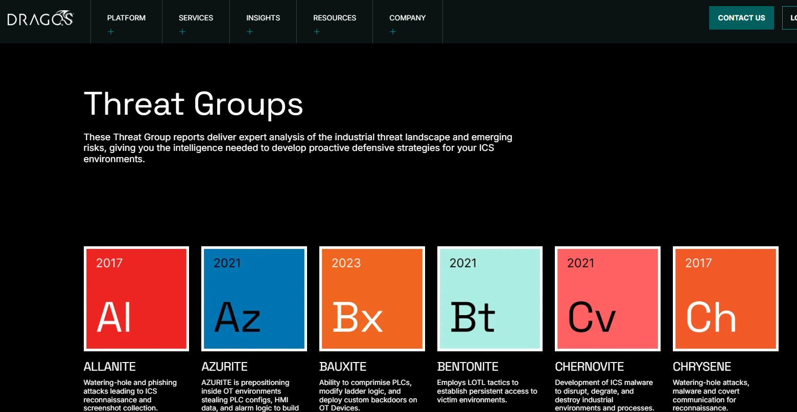

# Adversary Attack Path Simulation (AZURITE)

For this lab, I am doing adversary emulation in an OT/ICS environment. I will simulate the TTPs of an actual threat group called `AZURITE` (Dragos' term). AZURITE is a Dragos-tracked OT/ICS threat group. Dragos reports technical overlap with Flax Typhoon and Ethereal Panda, both of which are widely tracked as China-linked actors.

I will use the MITRE ATT&CK frameworks (Enterprise & ICS) and Dragos' resources to build this simulation. (Obviously the only thing I can use is publicly available information about this group, so most of the attack chain is **hypothetical, a product of my imagination!**)

Phase 1 — Initial Access

The attacker exploits the public-facing VPN appliance itself. They now have an OS foothold on the appliance. `AZURITE` is known for weaponizing publicly available exploit PoCs quickly, before companies patch the vulnerabilities.

They also use purpose-built VPS infrastructure instead of a controlled botnet. All of this happens at Purdue Level 5: Corporate IT, in this particular case, the external-facing DMZ.

Phase 2 — Persistence + Recon

The attacker quickly implants a webshell in the web root directory (where the VPN's web service is hosted) to establish persistence. This is important because a raw shell can be unstable and may disconnect. The attacker then establishes a pivot tunnel (SOCKS proxy) so they can scan the internal network behind the firewall using tools from their VPS infrastructure. Once the tunnel is established, the attacker uses nmap to scan the internal network.

Phase 3 — AD Enumeration/Exploitation

Meanwhile, the attacker can hunt for credentials. Although the VPN appliance's underlying OS may not be joined to the corporate Active Directory domain, it's possible to have network access to the domain controller if the VPN's web application is integrated with AD via LDAP.

If LDAP anonymous bind is enabled, the attacker can query and enumerate Active Directory information such as users, computers, groups, and account attributes without any authentication.

The attacker finds an account, `CORP\Peter`, with the `DONT_REQ_PREAUTH` attribute enabled. With this misconfiguration, the attacker is able to steal a Kerberos ticket, extract the password hash, and crack it offline (AS-REP roasting).

Now that the attacker has a valid domain credential, they run BloodHound to collect Active Directory information and map out the AD infrastructure. From this, the attacker uses ACL abuse to escalate privilege, gaining the developer credential `CORP\DevUser`.

Phase 4 — Jenkins

Recall that the attacker scanned the internal network in Phase 2. They find an internal web server (Jenkins) with port 443 open. The attacker logs in with the AD credential `CORP\DevUser` via Jenkins' web login page.

CI/CD applications like Jenkins have a built-in feature for executing commands on the underlying OS. This isn't necessarily a vulnerability being exploited, it is more like an intended feature abused through excessive authorization (the account had more permissions on Jenkins than it should have).

The attacker now has OS shell access via this abuse. They scan with nmap again to reach deeper into the internal network. All of this happens at Purdue Level 4: Enterprise Network.

By the way, from Purdue Level 5 to Level 4, the attacker actively uses Living Off the Land Binaries and Scripts (`LOLBins`/`LOLBAS`) to avoid detection and disable endpoint security agents (AV/EPP, EDR). Dragos reports that the `AZURITE` threat group actively uses `LOLBins` (T1562, Impair Defenses).

Phase 5 — OT DMZ (3.5)

The nmap scan finds the OT jump server's SMB port (445) open. The attacker uses the `CORP\DevUser` credential, reused across the environment, to authenticate over SMB and execute commands remotely on the OT jump server using `PsExec`-style tooling (Impacket's `psexec.py` or CrackMapExec/NetExec). This is credential-based lateral movement rather than a vulnerability exploit. `PsExec` itself isn't a CVE, it's a legitimate Sysinternals-style remote execution technique (T1021.002, Remote Services: SMB/Windows Admin Shares) that only works because the attacker already holds valid, overprivileged credentials.

This gives the attacker a shell on the OT jump server, located at Purdue Level 3.5 (DMZ).

Phase 6 — OPC UA

From the jump server, the attacker gains access to the OPC UA server. This is critical because the attacker no longer needs to touch an HMI or PLC directly. The OPC UA server holds control device data, like PLC values, in its address space, and can also perform write operations to PLCs.

With data from OPC UA and other endpoints connected to the jump server, like MES and the historian, the attacker now has a holistic view of the victim's OT infrastructure.

Phase 7 — Exfilteration 

My scenario ends here. The attacker exfiltrates all the data through the C2 channel (i.e., the VPS infrastructure). Based on Dragos's public reporting, AZURITE's observed activity is centered on theft/collection of OT operational information, not demonstrated process disruption.

However, the compromised OPC UA/HMI/SCADA infrastructure could potentially provide a path toward process manipulation if write privileges were available.

Conclusion/lesson learned

It was very interesting to use three materials together: Dragos' threat group report, the Enterprise MITRE ATT&CK matrix, and the ICS ATT&CK matrix. My offensive knowledge and skill aren't comparable to real APT groups, and probabily `AZURITE`'s attack chains are much more complicated in reality, but I did my best to build a realistic attack path simulation based on the information available about AZURITE and my offensive knowledge.

It was also interesting to see exactly how an IT-side attack converts into an OT-side attack, the pivot points, the credentials that carry over, the moment a purely enterprise compromise becomes an OT problem. Since I work in an OT environment myself, I could relate to a lot of this directly, and walking through it from the attacker's side gave me a better sense of what to watch for as a defender.

Bringing together my offensive security study and the OT protocol lab work I'd done previously was very satisfying.

I used Excalidraw to map out the attack chain. I can't recommend that tool enough!

