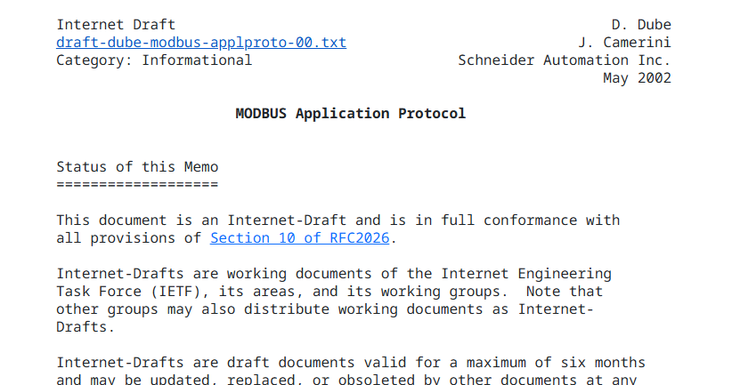

# Modbus TCP Wireshark Lab

I am studying about the Modbus protocol, to better understand the OT environment I am working at.

I read the official Modbus Application Protocol RFC on the side while doing the lab. It is written by Schneider Automation (owns Modicon, that invented the first PLC)



Initial Setup

I have Kali VM already running on Oracle VB.


I've installed mbpoll (Modbus TCP master (client)) and Wireshark on Kali environment

```bash
# Create the lab folder and move into it
mkdir -p ~/modbus-lab && cd ~/modbus-lab

# Create an isolated Python environment so pymodbus can't collide with system packages
python3 -m venv venv

# Upgrade pip inside that environment (avoids a stale-pip install failure)
./venv/bin/pip install --upgrade pip

# Install the EXACT pymodbus version this lab was tested against
./venv/bin/pip install "pymodbus==3.15.0"

# Refresh the package index, then install the Modbus master and the capture tool
sudo apt update && sudo apt install -y mbpoll wireshark
```

I've verified the installation with the following commands:

```bash
# Should print exactly: 3.15.0
./venv/bin/python -c "import pymodbus; print(pymodbus.__version__)"

# Should print mbpoll's usage banner — proves the master is on PATH
mbpoll -h | head -3
```


Next, I wrote a simple python code (with the help of AI) for simulating a Modbus TCP slave (server)

I am using pymodbus ([github.com/pymodbus-dev/pymodbus](http://github.com/pymodbus-dev/pymodbus)) for this.

```python
#!/usr/bin/env python3
"""Minimal Modbus TCP slave for protocol study. pymodbus 3.15.0."""
import logging
from pymodbus.server import StartTcpServer
from pymodbus.simulator import SimData, SimDevice, DataType

# Print server activity to the terminal so you can see requests arriving
logging.basicConfig(level=logging.INFO,
                    format="%(asctime)s %(levelname)s %(message)s")

# The four Modbus data tables. 100 entries each, all starting at address 0.
di = [SimData(0, count=100, values=False, datatype=DataType.BITS)]       # discrete inputs   -> FC 02 (read-only)
co = [SimData(0, count=100, values=False, datatype=DataType.BITS)]       # coils             -> FC 01/05/15
ir = [SimData(0, count=100, values=0,     datatype=DataType.REGISTERS)]  # input registers   -> FC 04 (read-only)
hr = [SimData(0, count=100, values=0,     datatype=DataType.REGISTERS)]  # holding registers -> FC 03/06/16

# Bundle the four tables into one device answering to unit / device ID 1
device = SimDevice(1, simdata=(di, co, ir, hr))

print("[*] Modbus TCP slave on 0.0.0.0:502, unit ID 1, 100 of each table")
print("[*] Ctrl+C to stop")

# Start listening. Blocks forever until you press Ctrl+C.
StartTcpServer(device, address=("0.0.0.0", 502))
```

I saved as [slave.py](http://slave.py) and made it executable.

```bash
# Open a new empty file in the nano text editor
vi ~/modbus-lab/slave.py

# Make it executable
chmod +x slave.py
```


I ran the [slave.py](http://slave.py) to listen on port 502 simulating the slave (Server)

```bash
sudo /home/kali/modbus-lab/venv/bin/python /home/kali/modbus-lab/slave.py
```


*For people who have never run Wireshark before on their kali box:

```bash
# Re-run the Wireshark setup prompt; choose <Yes> so non-root users can capture
sudo dpkg-reconfigure wireshark-common

# Add your user to the wireshark group that the previous step authorised
sudo usermod -aG wireshark $USER

# Apply the new group to this shell without logging out
newgrp wireshark
```

Run Wireshark.

```bash
# Start Wireshark and capture packets
wireshark
```

I double-clicked the loopback address since this is all happening on the same machine


Now it was time to generate Modbus traffic using the mbpoll tool, simulating Master (Client) request traffic

```bash
# FC 03 — read 5 holding registers, starting at reference 1, poll once
# -m tcp = Modbus TCP | -a 1 = unit ID | -r 1 = start reference
# -c 5 = count | -t 4 = holding registers | -1 = single poll
mbpoll -m tcp -a 1 -r 1 -c 5 -t 4 -1 127.0.0.1
```


I saw the traffic being captured by Wireshark


However, I didn't want to see TCP handshakes (noise) as I only want to focus on Modbus packets, so I filtered with the string "modbus"


Request packet (from Master - Client)


I know I don't have to care about the first 4 rows, as those are OSI layer 1-4. I focused on seeing the Modbus payload from the application layer (7)

I can clearly see the division between the Modbus header (which is called Modbus Application Protocol, aka. MBAP header) and the Modbus PDU. The header contains the Transaction Identifier, which is used to track the request-response sequence. I am not sure why this was implemented in the first place, as I learned that the original Modbus RTU (Modbus protocol via serial) only has a Unit ID in the header. My guess is that this was implemented to enable concurrency while avoiding errors. But... concurrency is for speed, and I am not sure there's a study measuring the speed improvement due to the concurrency. This will be hard to measure because ethernet communication is significantly faster than serial communication anyway.

Next, the protocol identifier... this is always 0. According to the official Modbus Application Protocol RFC written by Schneider, other values are reserved for future changes to the protocol, but until now it seems like we are only using 0.


Length includes the byte count of the remaining fields in the packet.

Unit ID is basically the Modbus server identification. This is usually set up by the asset owner (of the PLC), and according to what I know, one PLC can have multiple Modbus servers, or even when PLCs are connected, we need to identify each server.

And finally... the Modbus PDU has two fields: Function code and the memory address. It shows 03 = Reading Holding Registers and reference 0 with 5 counts.

Response packet (from Slave - Server)


I used -c 5 (5 count) starting from 1, so this means Holding register 40001 - 40005. Not sure why, in the packet, it starts from register 0, not 1, but still, I clearly see I got 5 values as intended. Coil (00001 - 09999) and Holding Register (40001 - 49999) hold a value type of 16 bits numeric. Since I did not write anything in those memory locations, what I get are 0s.

I wrote in the Holding register the value of 4242

```bash
# FC 06 — write the single value 4242 into holding register reference 4
# (supplying a value after the IP is what turns a read into a write)
mbpoll -m tcp -a 1 -r 4 -t 4 127.0.0.1 4242
```


and tried to read the register to see if the value changed

```bash
# FC 03 — read the same block back to confirm the write landed; expect [4]: 4242
mbpoll -m tcp -a 1 -r 1 -c 5 -t 4 -1 127.0.0.1
```


I was also able to write multiple registers in one request

```bash
# FC 16 — write MULTIPLE registers in one request: 111,222,333 from reference 10
# (three values instead of one is what promotes FC 06 to FC 16)
mbpoll -m tcp -a 1 -r 10 -t 4 127.0.0.1 111 222 333
```


I also tried polling continuously like how an HMI behaves

```bash
# FC 03 on repeat — continuous polling, the way a real HMI behaves
# -R = repeat forever. Let it run ~30 seconds, then press Ctrl+C
mbpoll -m tcp -a 1 -r 1 -c 10 -t 4 -R 127.0.0.1
```


I also wanted to see the Modbus protocol Exception Response. As I know, Modbus has 3 different types of packets: Request, Response, Exception Response. This is basically an error response from the PLC.

```bash
# ANOMALY 1 — request a range that runs past the end of the 100-register table.
# Expect mbpoll to print "Illegal data address" and the slave to reply with an exception.
mbpoll -m tcp -a 1 -r 95 -c 20 -t 4 -1 127.0.0.1
```


I could see the Exception Response packet in Wireshark

### Conclusion

This was a small lab, but I now understand how Modbus actually behaves on the wire instead of just knowing the terms. I can read the MBAP header and the PDU, tell which function code maps to which data table and direction, and recognize a request, a response, and an exception response in Wireshark.

Interestingly, there is no authentication anywhere in this. My write to holding register 4 succeeded because I asked. There was no login, no session, no check of who I was. Anything that can reach TCP/502 can read and write process values.

That's the protocol as designed in 1979 for a cable in a locked cabinet, and it means detection in OT has to come from context (which source, which function codes, what cadence) rather than from packet contents.

Next I want to do the same wire-level walkthrough with DNP3, S7comm, and EtherNet/IP, and eventually OPC UA as a contrast since it actually has authentication built in.
