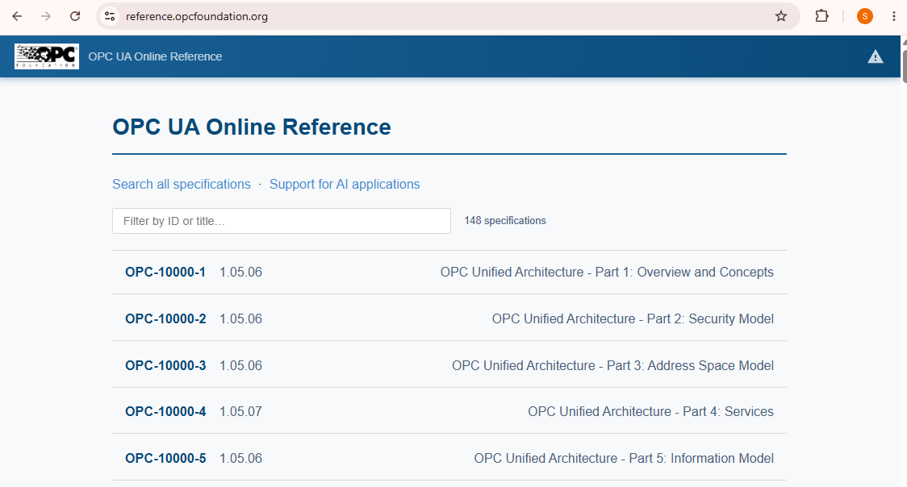

# Lab#2 OPC UA

I am studying the OPC UA protocol. I will simulate OPC UA server and client communication on my Kali Linux VM using simple Python scripts. The scope is narrow: I just want to see the communication. The lab won't replicate the physical reality where sensors and actuators connect to a PLC, then to an OPC UA server, and then upward to an HMI, MES, and so on.



I will read the official docs at [https://reference.opcfoundation.org/](https://reference.opcfoundation.org/), but unlike the Modbus Application Protocol spec, this one is very long. So for now I will just skim Parts 1 through 4, only the sections relevant to the lab, to solidify my understanding.

Initial Setup

I have a Kali VM ready on Oracle VB.


I did a basic setup for the lab, installing the OPC UA Python library.

```bash
# Create the lab directory and move into it.
mkdir -p ~/opcua-lab/artifacts && cd ~/opcua-lab

# Create an isolated Python environment. Kali marks system Python "externally managed",
# so installing packages globally will fail. This sidesteps that.
python3 -m venv .venv

# Activate it. Your prompt should now start with (.venv).
source .venv/bin/activate

# Install the OPC UA library. This also installs the ua* CLI tools.
pip install asyncua
```

Then I built an OPC UA server in Python, with the help of AI.

```python
import asyncio
import logging
import random
from asyncua import Server, ua

# Suppress verbose asyncua internal logging; only show warnings and above
logging.basicConfig(level=logging.WARNING)

# OPC UA server connection details
ENDPOINT = "opc.tcp://127.0.0.1:4840/freeopcua/server/"
NAMESPACE_URI = "http://lab.local/opcua/"

async def main():
    # Create and initialize the OPC UA server
    server = Server()
    await server.init()
    server.set_endpoint(ENDPOINT)
    server.set_server_name("Weekend Lab OPC UA Server")

    # Register a custom namespace so our nodes don't collide with standard OPC UA nodes
    idx = await server.register_namespace(NAMESPACE_URI)

    # Create a "Pump01" object under the server's default Objects folder
    pump = await server.nodes.objects.add_object(idx, "Pump01")

    # Add variables (tags) to the pump object, each with an initial value
    temperature = await pump.add_variable(idx, "Temperature", 20.0)
    setpoint = await pump.add_variable(idx, "Setpoint", 50.0)
    running = await pump.add_variable(idx, "Running", False)

    # By default, variables are read-only to clients.
    # Explicitly allow clients to write to Setpoint and Running.
    # (Temperature stays read-only since it's simulated by the server below.)
    await setpoint.set_writable()
    await running.set_writable()

    # Print a summary of the server's node structure for reference
    print(f"Endpoint:        {ENDPOINT}")
    print(f"Namespace URI:   {NAMESPACE_URI}")
    print(f"Namespace index: {idx}")
    print(f"  Pump01       -> {pump.nodeid.to_string()}")
    print(f"  Temperature  -> {temperature.nodeid.to_string()}  (read-only to clients)")
    print(f"  Setpoint     -> {setpoint.nodeid.to_string()}  (writable)")
    print(f"  Running      -> {running.nodeid.to_string()}  (writable)")
    print("Server running. Ctrl+C to stop.")

    # Start the server (async context manager handles startup/shutdown)
    async with server:
        while True:
            await asyncio.sleep(1)  # simulate one update per second

            # Simulate a fluctuating temperature reading by nudging
            # the current value up or down by a small random amount
            current = await temperature.read_value()
            await temperature.write_value(round(current + random.uniform(-0.3, 0.3), 2))

if __name__ == "__main__":
    asyncio.run(main())
```

What this script is building:

The script simulates an OPC UA server that holds the following AddressSpace.


AddressSpace is the most important concept in how OPC UA operates. It has its own dedicated doc, like the one below, and it runs over 4000 lines.


I personally felt §4.4 (the Node / Attribute / Reference model) was the most relevant section for this lab.


Moving on, I ran the Python script, starting the OPC UA server listening on port 4840.


I opened Wireshark and captured loopback traffic with the filter "tcp port 4840".


Next I generated initial discovery traffic with the following command:

```bash
# Ask the server what endpoints it offers. This is OPC UA "discovery" —
# it happens BEFORE any authentication, by design.
uadiscover -u opc.tcp://127.0.0.1:4840/freeopcua/server/
```


I applied a display filter "opcua" to cut down the noise, and added source/destination port columns so I had a clear view of the conversation.


**`Hello`** (client → server) and **`Acknowledge`** (server → client). This is the OPC UA transport handshake, negotiating buffer and message sizes. It happens before anything else.


However, what I used here is just a discovery tool, so I don't see any session opening after the negotiation.

Next I built an OPC UA client emulator, again with the help of AI. I am using the FreeOpcUa/opcua-asyncio project ([https://github.com/FreeOpcUa/opcua-asyncio](https://github.com/FreeOpcUa/opcua-asyncio)). FreeOpcUa's own project page states that opcua-asyncio is currently their most actively maintained project.

```python
import asyncio

from asyncua import Client, ua

URL = "opc.tcp://127.0.0.1:4840/freeopcua/server/"
NAMESPACE_URI = "http://lab.local/opcua/"

# The standard Server object has many descendants describing server internals;
# print it but don't descend into it
SKIP_DESCENT = {"Server"}

async def browse(node, depth=0, max_depth=3):
    """Recursively walk the address space by following references."""
    for child in await node.get_children():
        browse_name = await child.read_browse_name()
        node_class = await child.read_node_class()
        print(f"{'    ' * depth}|- {browse_name.Name:<20} "
              f"{child.nodeid.to_string():<14} ({node_class.name})")
        if depth + 1 < max_depth and browse_name.Name not in SKIP_DESCENT:
            await browse(child, depth + 1, max_depth)

async def main():
    # Connect, browse, and disconnect cleanly via the context manager
    async with Client(url=URL) as client:
        print(f"Connected: {URL}")

        # Resolve the namespace index at runtime rather than hardcoding it
        idx = await client.get_namespace_index(NAMESPACE_URI)
        print(f"Resolved namespace index for {NAMESPACE_URI}: {idx}\n")

        print("=== ADDRESS SPACE (from Objects folder) ===")
        await browse(client.nodes.objects)

        # Resolve nodes by browse path so they survive a server rebuild
        pump = await client.nodes.objects.get_child([f"{idx}:Pump01"])
        temperature = await pump.get_child([f"{idx}:Temperature"])
        setpoint = await pump.get_child([f"{idx}:Setpoint"])

        # --- READ ---
        print("\n=== READ ===")
        print(f"Temperature       = {await temperature.read_value()}")
        print(f"Setpoint (before) = {await setpoint.read_value()}")
        print(f"Setpoint DataType = {(await setpoint.read_data_type_as_variant_type()).name}")

        # --- WRITE ---
        print("\n=== WRITE ===")
        await setpoint.write_value(ua.Variant(72.5, ua.VariantType.Double))
        print("Wrote 72.5 -> Setpoint")
        print(f"Setpoint (after)  = {await setpoint.read_value()}")

        # --- ACCESS CONTROL CHECK ---
        # Temperature is read-only to clients; this write should be rejected
        print("\n=== ACCESS CONTROL CHECK ===")
        try:
            await temperature.write_value(ua.Variant(999.0, ua.VariantType.Double))
            print("UNEXPECTED: write to Temperature succeeded")
        except ua.UaStatusCodeError as exc:
            print(f"Write to Temperature rejected as expected: {exc}")

if __name__ == "__main__":
    asyncio.run(main())
```

The script emulates a short period of an HMI's interaction with an OPC UA server. It connects and establishes a session, then browses the server's address space to discover what's there, finding an object `Pump01` containing three variables: `Temperature`, `Setpoint`, and `Running`. No prior knowledge of the tag layout is needed; the server describes itself on request.

It then reads `Temperature` and `Setpoint`, writes 72.5 to `Setpoint`, and finally attempts to write to `Temperature`, which should be refused since that node is read-only to clients.

Next I started the OPC UA client script.

```bash
python3 lab_client.py
```

The output:


I got the output as intended. Connection success → browse the address space → read Temperature (13.97) and Setpoint (50.0) → write 72.5 to Setpoint → attempt to write Temperature, which fails with `BadUserAccessDenied`.

Then I wanted to see the packets in Wireshark.

Since I didn't want to see the discovery traffic, I filtered with:

```bash
# 53652 is the client's ephemeral port used.
opcua && tcp.port == 53652
```


I can see the session starts with the same four-stage pattern: Hello handshake → OpenSecureChannel → CreateSession → ActivateSession.


I took a look at the OpenSecureChannel message sequence.

I am no expert in this OPC UA protocol (yet), but I can see fields related to certificates, so I can guess this is some kind of security measure providing machine-based access control. I also see the server responded with a SecureChannelId of 10, and a Security Token Id of 13. The sequence number starts at 1.


Now moving on to CreateSessionRequest / Response.

The Security Token Id (13) shown here is the same one issued during OpenSecureChannel; it appears in the header of every message on that channel from now on. The actual session identifier is the `AuthenticationToken` in the response body, which the client will attach to every later request to prove it belongs to this session. The sequence number has increased from 1 to 2.


Moving on to ActivateSessionRequest, I found an interesting field associated with the user identity token.

So the SecureChannel handles machine identity, and ActivateSession handles user identity. Two separate checks. And of course, here in the lab, the client provides nothing for either one.


I was able to find the two write requests.

In the first write request, I located the namespace index and identifier (`ns=2;i=3`), which is Setpoint, with an attempt to write the value 72.5.


This came back with the positive result "Good".


Next, the second write attempt. I can see it is pointing to Temperature (`ns=2;i=2`) and attempting to write 999.


In a real system Temperature would come from a sensor, so it is read-only. The result comes back from the server with the error "BadUserAccessDenied".


And that is it for this lab.

**Conclusion**

OPC UA was much harder for me to grasp than the Modbus Application Protocol. It took me a while to even understand its purpose. And I felt like the information available about this protocol in the context of OT cybersecurity was scarce compared to Modbus. I am glad that I did this hands-on lab, because I was able to see how OPC UA actually behaves on the wire. Now I can read the connection sequence and say what each stage does: Hello and Acknowledge negotiate message sizes, OpenSecureChannel sets the security terms for everything that follows, and CreateSession and ActivateSession establish machine identity and user identity as two separate checks. After that it settles into request/response pairs (Browse, Read, Write) that carry a session token proving they belong to that session. The lab took much more time than the Modbus one, but it was worth it.